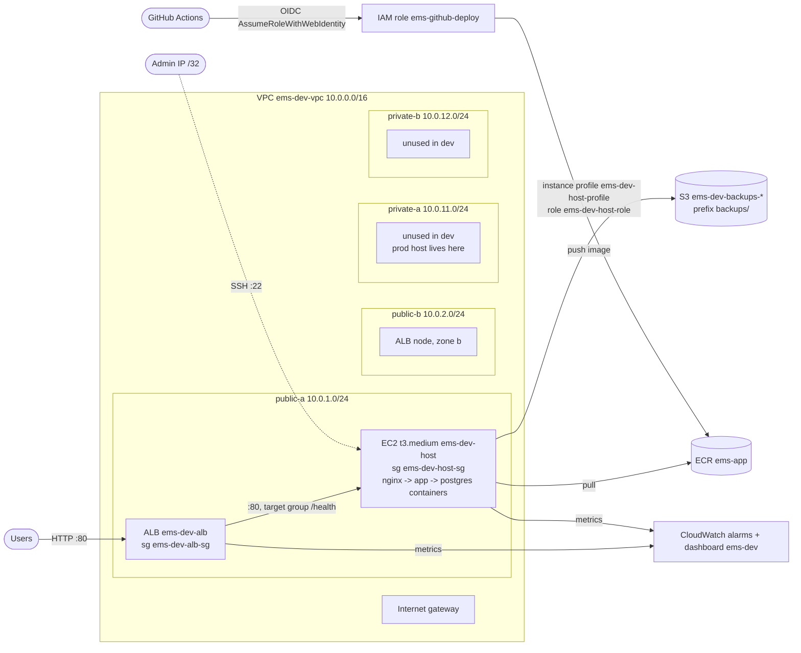

# AWS architecture (Phases 14-15, built by Terraform since Phase 20)

Everything below is created by `terraform/envs/dev` (plus `terraform/registry` for ECR and the GitHub role, and
`terraform/bootstrap-state` for the Terraform state). Names are `ems-dev-*`; prod uses `ems-prod-*`.



## Network

| Resource | Value |
|---|---|
| VPC | `10.0.0.0/16`, DNS support and hostnames on |
| Public subnets | `10.0.1.0/24` (zone a), `10.0.2.0/24` (zone b); `map_public_ip_on_launch = true` |
| Private subnets | `10.0.11.0/24` (zone a), `10.0.12.0/24` (zone b); no public IPs |
| Internet gateway | `ems-dev-igw` |
| Public route table | `0.0.0.0/0 -> igw`, associated with both public subnets |
| Private route tables | one per zone; local route only in dev (no NAT). In prod: `0.0.0.0/0 -> NAT gateway` of the same zone |

The ALB requires subnets in two zones; that is why there are two of everything even though there is one host.

## Security groups

| Group | Inbound | Outbound |
|---|---|---|
| `ems-dev-alb-sg` | TCP 80 from `0.0.0.0/0` | TCP 80 to `ems-dev-host-sg` only |
| `ems-dev-host-sg` | TCP 80 from `ems-dev-alb-sg` only; TCP 22 from the admin `/32` (none in prod; CD adds the runner's IP for the length of a deploy) | all (packages, ECR, S3) |

The host's public IP answers nothing on port 80 from the internet: only the ALB's security group is allowed.

## Request path

```
user -> ALB :80 (2 zones, idle timeout 60 s, drops invalid headers)
     -> target group ems-dev-tg :80 (health check GET /health every 15 s, 2 healthy / 3 unhealthy)
     -> EC2 t3.medium (Amazon Linux 2023, IMDSv2, encrypted gp3 20 GB, standard CPU credits)
        -> nginx container :80 -> app container (gunicorn :5000) -> postgres container :5432 (Docker volume)
```

The containers are the Compose stack from Phase 17 (`docker-compose.yml`), installed and updated by Ansible
(`ansible/roles/ems_stack`) from the inventory Terraform writes. `/health` checks app + database, so a dead
database makes the target unhealthy.

## Identity (no keys anywhere)

| Principal | How it authenticates | What it may do |
|---|---|---|
| EC2 host: role `ems-dev-host-role`, instance profile `ems-dev-host-profile`, managed policy `ems-dev-host-policy` | instance metadata (IMDSv2, hop limit 2 so containers can use it) | `s3:ListBucket` on the backup bucket; `s3:PutObject`/`GetObject` on `ems-dev-backups-*/backups/*`; ECR token + pull from `ems-app`; CloudWatch Logs under `/ems/*` |
| GitHub Actions: role `ems-github-deploy` (`terraform/registry`) | OIDC (`token.actions.githubusercontent.com`, audience `sts.amazonaws.com`, `sub` = `repo:<owner>/<repo>:*`) | push to `ems-app`; describe EC2/ELB; add/remove SSH rules only on security groups tagged `Project=ems` |

## Storage

- **S3 `ems-dev-backups-<random>`**: private (public access block), SSE-S3, versioned; `backups/` objects expire after
  30 days, old versions after 7. The host's nightly `pg_dump` timer writes here.
- **ECR `ems-app`** (`terraform/registry`): immutable tags, scan on push, keeps the newest 20 images.
- **State**: S3 `ems-tfstate-<account>` + DynamoDB `ems-tf-locks` (see `docs/terraform/state-and-backend.md`).

## Observability from outside the host

CloudWatch alarms `ems-dev-alb-5xx`, `ems-dev-alb-unhealthy-hosts`, `ems-dev-host-cpu-high`,
`ems-dev-host-status-check` and the dashboard `ems-dev` (requests/5xx, p95 latency, healthy hosts, CPU and credit
balance). Details: `docs/observability/cloudwatch.md`. Prometheus/Grafana run on the host itself.

## prod (planned only)

Same modules: host in `private-a` without a public IP or SSH, one NAT gateway per zone for outbound traffic,
backup bucket without `force_destroy`. See `docs/terraform/modules-and-environments.md`.
