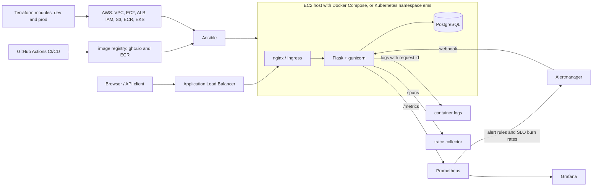

# Capstone architecture

The picture below is the **target**: what the repository contains after the last phase. Nothing of it exists yet
except the application. Keep it open while you work; each phase fills in one part.



## The request path, layer by layer
| Hop | Local machine | AWS host | Kubernetes |
|---|---|---|---|
| Name | `/etc/hosts`: `ems.local` | the DNS name of the load balancer | `localhost:8080` on kind; the load balancer of the ingress controller on EKS |
| Entry | nginx on port 80 | Application Load Balancer on port 80, then nginx | Ingress controller, then the Service `ems-app` |
| Application | gunicorn on `127.0.0.1:5000` (systemd, later a container) | the same | pods on port 5000 |
| Data | PostgreSQL on `127.0.0.1:5432` | the same | StatefulSet `postgres` |

## Build order: one line per phase
Read it as "the application, plus ...".
```
0-10   the application                python run.py
11     + a plan                       target role, scope, architecture, repository structure, milestones
12     + a Linux service              systemd, PostgreSQL, releases, backups, troubleshooting tools   (shell scripts)
13     + a network                    client -> nginx :80 -> gunicorn 127.0.0.1:5000, host firewall
14     + a cloud network              VPC, subnets, routes, security groups                           (AWS CLI scripts)
15     + compute and a load balancer  EC2 behind an ALB, IAM instance profile, S3 backups              (AWS CLI scripts)
16     + configuration management     Ansible replaces the shell installer
17     + containers and a registry    image and Compose replace the Linux services; ECR
18     + continuous integration       every push is linted, tested and scanned
19     + continuous delivery          a tag is deployed behind an approval, a click rolls back
20     + infrastructure as code       Terraform replaces the AWS CLI scripts: state, backend, variables, outputs, drift
21     + modules and environments     one set of modules, dev and prod
22     + an orchestrator              the same image on Kubernetes (kind)
23     + a managed cluster            EKS, Ingress, autoscaling, failures, rollout and rollback
24     + observability                metrics, logs, traces, alerting
25     + reliability practice         SLOs, runbooks, game days
26-29  + AI operations                agents that investigate the platform
30     + the presentation             final review, resume, GitHub, mock interview, job plan
```

## Build it by hand once, then let a tool take over
Four times a later phase removes files that an earlier phase wrote. This is deliberate.

| First, by hand | Then, with a tool | What the hand-made version teaches |
|---|---|---|
| Phase 12-13: `install.sh`, `deploy.sh`, `rollback.sh` | Phase 16: Ansible roles and playbooks | what an idempotent task has to check, because you wrote the checks in Bash |
| Phases 12-16: systemd unit, host nginx, host PostgreSQL | Phase 17: container image and Compose stack | what a container packages: a process, its user, its files, its ports, its restart rule |
| Phases 14-15: AWS CLI scripts for network, instance, load balancer, IAM | Phase 20: Terraform | which resources exist and in which order, and why a tool that keeps state is better |
| Phase 20: one flat Terraform configuration | Phase 21: modules and environments | what a module boundary is, because you saw the same file without one |

## Decisions
Decisions that are hard to reverse are written down when they are made, in `docs/adr/`. This phase records the
first two; later phases add theirs.
